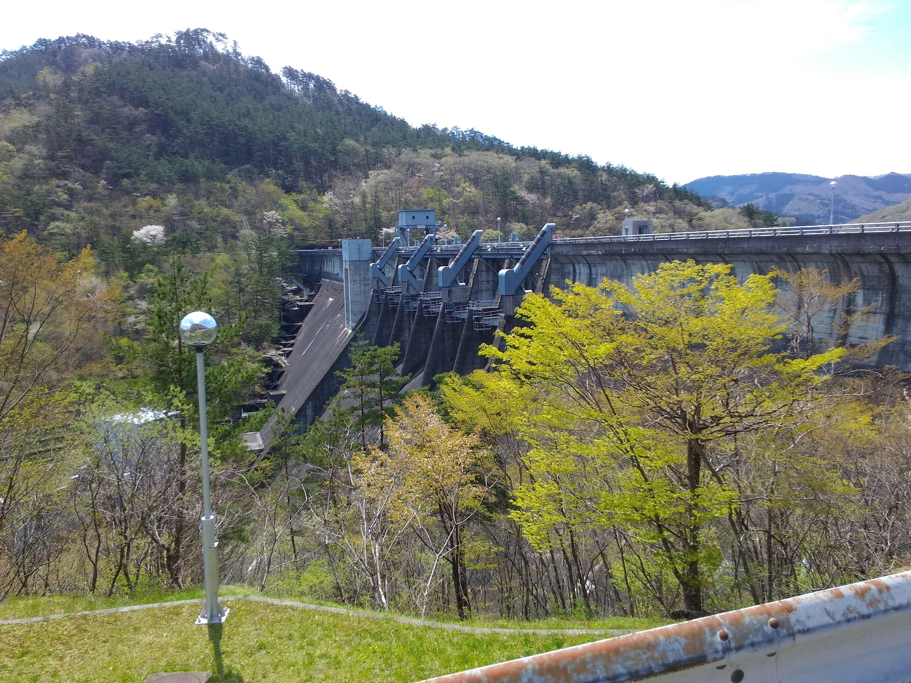
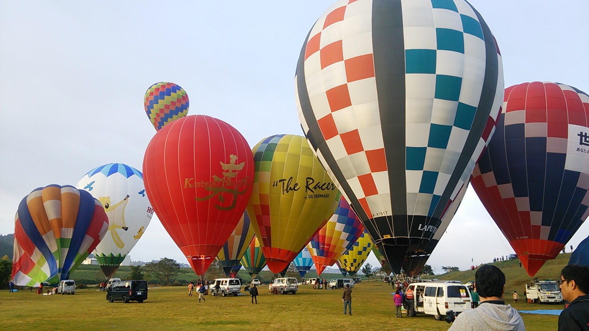

# 趣味

## 廃道・廃線・廃隧道

* 今はもう使われていない道、鉄道、トンネルなど
* 身近なところだと、有壁隧道とか
* 探索に行きたいけど交通手段がない…
* [山さ行がねが](http://yamaiga.com/)をよく見てます

## 地図・航空写真

* 自分が生まれる前の町の様子とかを調べてます
* 昔の航空写真とGoogleMapを比較したり、ストリートビューを見たりすることが多いです
* 国土地理院の[地図・空中写真閲覧サービス](http://mapps.gsi.go.jp/maplibSearch.do#1)は素晴らしい

## ダム

* 湯田ダムと田瀬ダムに行きました
* 巨大なコンクリート構造物っていいですよね
* ダム湖の湖底にある廃墟なんかも好きです

## 熱気球

* 地元の熱気球クラブに所属し、熱気球搭乗体験会のサポートや、バルーンフェスティバルの運営サポートを行っています

